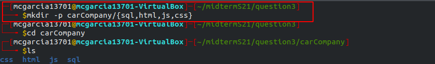
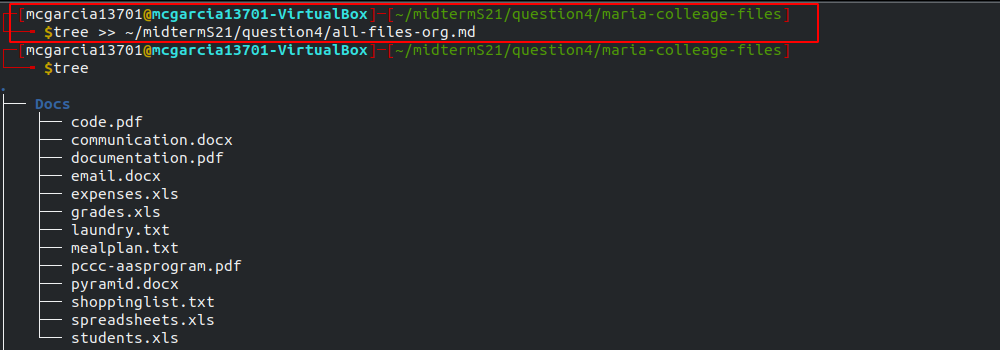
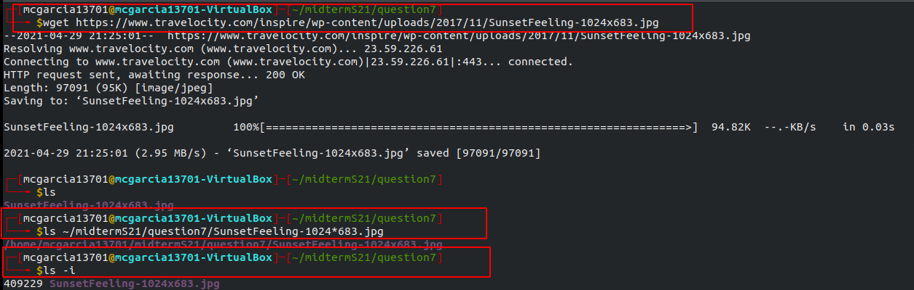
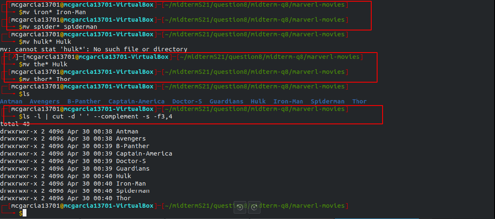
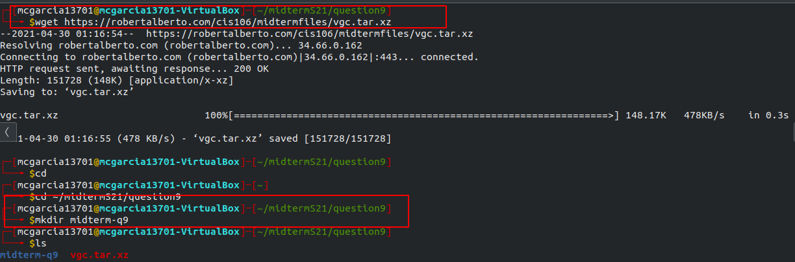

* Name: **Michelle Garcia**
* Semester: **Spring 2021**
# Midterm Spring 2021

## Question 1

* **I, believe it is a good idea to migrate to Ubuntu instead of upgrading windows and buying new hardware because Ubuntu just has so much to offer. You can download and install Ubuntu for free. All future upgrades are free and are installed automatically. Ubuntu has their own version of Microsoft Office called Open Office which is preinstalled at no cost. You do not have to buy expensive hardware and you will be generally free from viruses compared to Windows who needs antivirus. Ubuntu comes with a free long term support and high customization. Besides the fact that you will save money in a matter of ways you would continue to support Ubuntu whose philosophy is “Every computer user should have the freedom to download, run, copy, distribute, study, share, change and improve their software for any purpose, without paying licensing fees.”**
  
## Question 2

## Question 3

## Question 4

## Question 5

## Question 6

## Question 7

## Question 8

## Question 9

## Question 10
* In my opinion, the hardest question was Question #5. The reason is because I had to keep refreshing thr website and checking on my progress to fix the website.
  
* In my opinion, the easiest question had to be question #6. The reason is because I was able to complete this question with only two commands.
* What would have made the midterm easier is if the user(myself) had tried out the commands excessively. 
* Even though you might just be going over the basics of Linux I feel like I have learned a whole new universe. Out of all the classes I can really say I learned the most in this class especially knowledge I will have way after.
* I have never really taken an exam like this before but it really made me think like I have never before. Trying to figure out your way to do things or fix it can be time consuming but if you have knowledge you will do it one way or the other.