# Lab 3 | Installing software and navigating the file system | Answers
Assignment description [here](https://raw.githubusercontent.com/ra559/cis106/main/labs/lab3.md)

## Question 1
1. Which command did you use to search for the themes and to install them?
* **Search:** apt search theme or apt search 'gtk theme'
* **Install:** sudo apt install yuyo-gtk-theme
2. Which commands did you use to find and install the web browser?
* **Search:** apt search "web browser"
* **Install:** sudo apt install gnome-core --no-upgrade

3.1 What is the name of the package?
* **Extremetuxracer**
  
3.2 What dependencies are needed in order to install the package? (you can either take a screenshot of the terminal or copy and paste from the terminal)

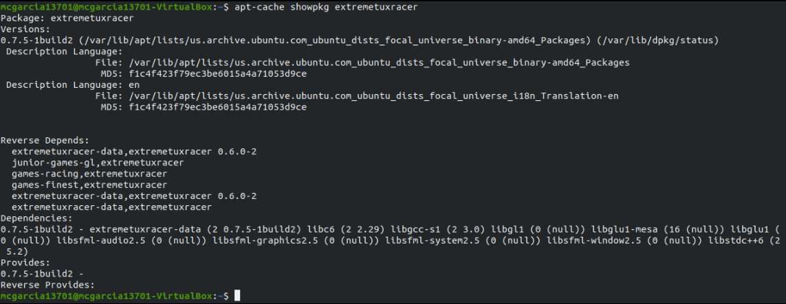

3.3 How much disk space will the package utilize after installation?

* **49.0 MB of additional disk space will be used.**
 

## Question 2

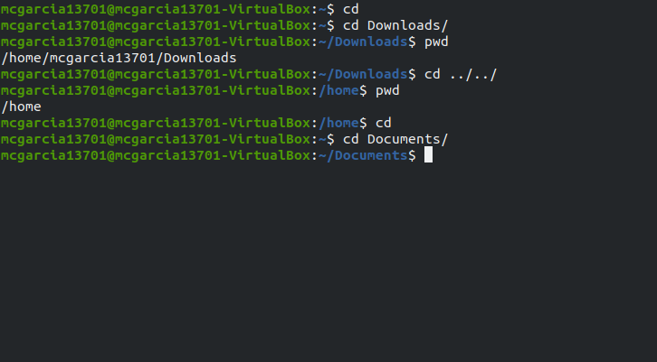

## Question 3
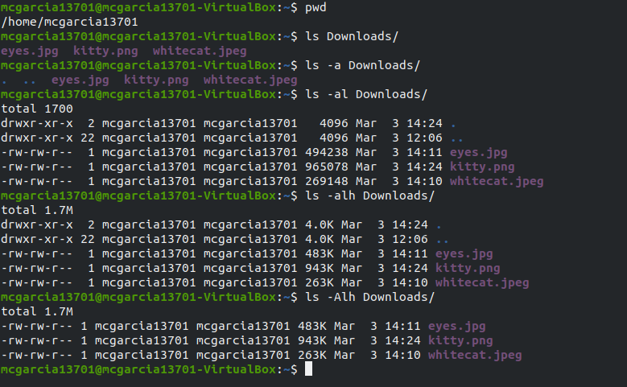

## Question 4
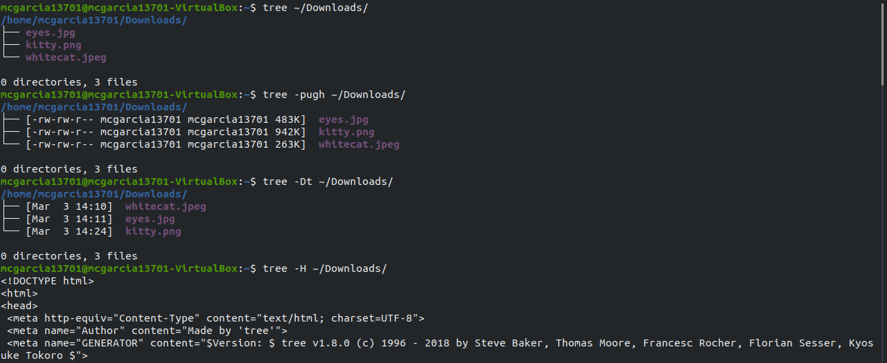
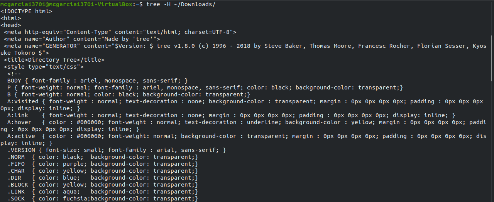
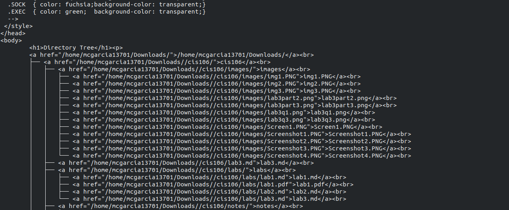
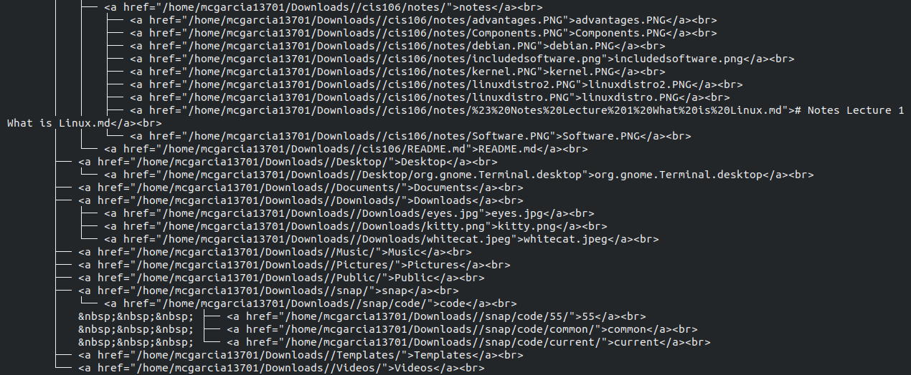
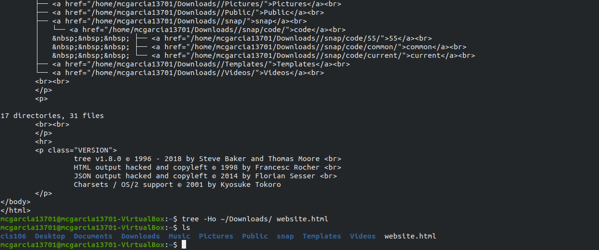

## Question 5
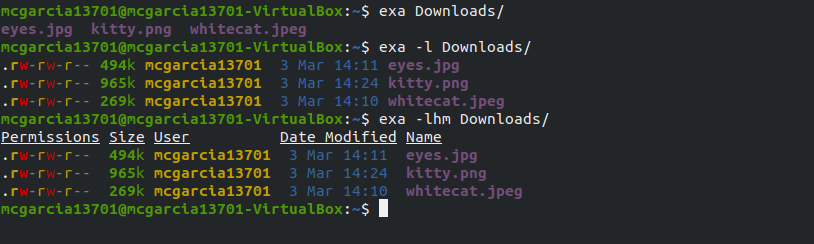
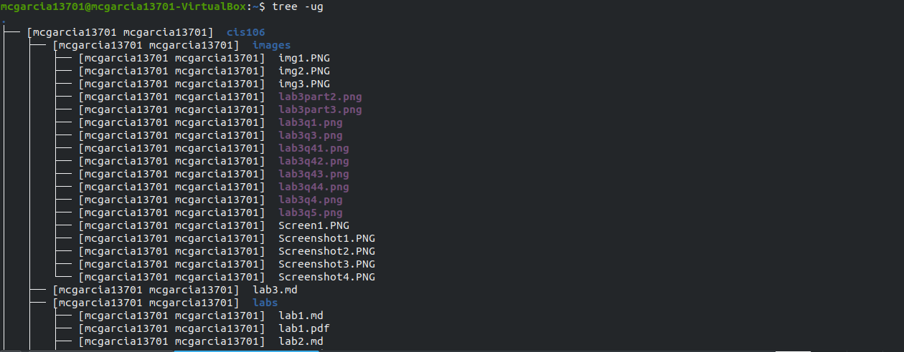
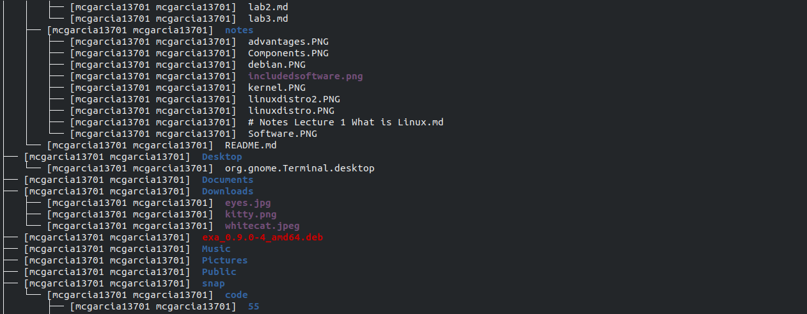
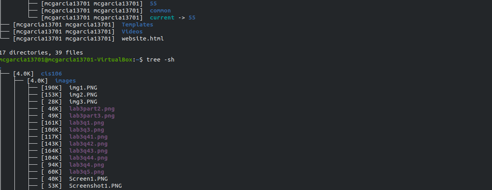
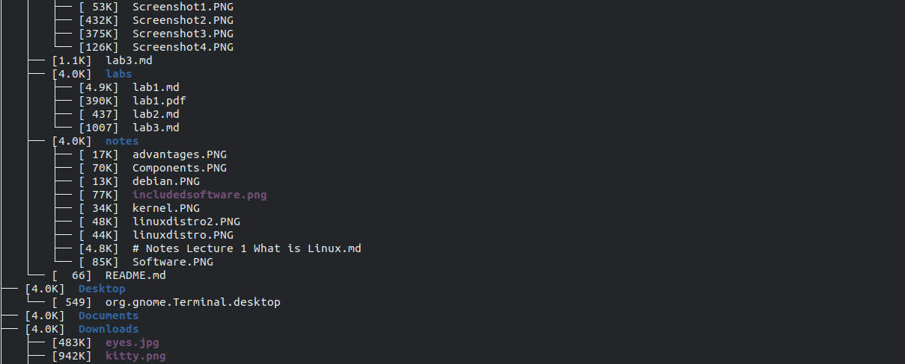
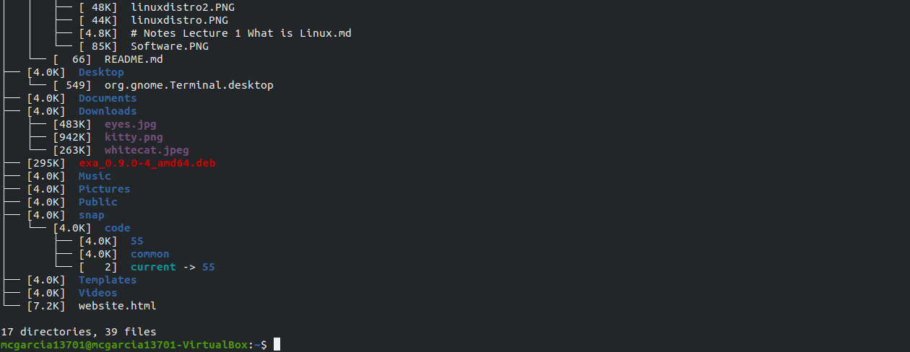
