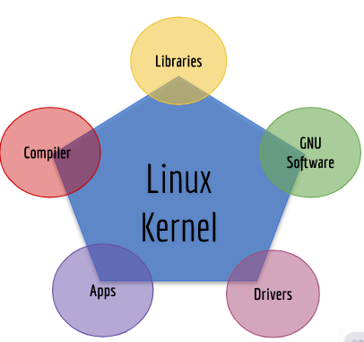
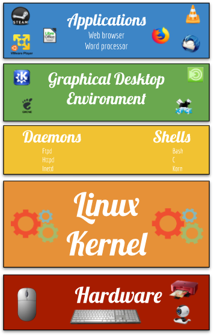
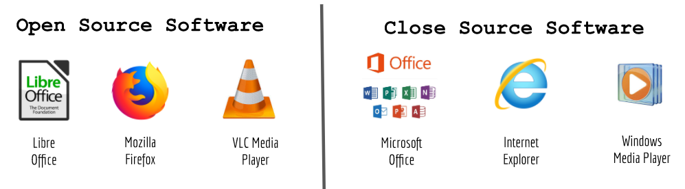
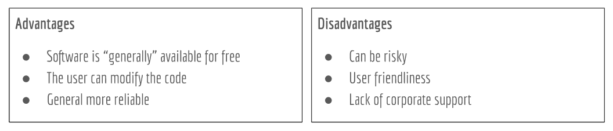

# Notes Lecture 1 What is Linux

## Why do you need to learn linux?
* Linux runs in alot of devices. Example: Laptops, desktops, servers, smartphones, IoT devices, etc
* Linux powers the cloud
* Linux is used by alot of companies even Microsoft

## What is Linux?
* Linux is a kernel. A kernel is the core of any operating system.
* An operating system that uses the Linux kernel is called a Linux distribution. Example: Ubuntu and Android.
* Linux is a multitasking, multi-user, and multipurpose OS.
* Linux is a modular operating system.

## Linux books I can use:
* Linux Administration A Beginner's Guide 8th Edition by Wale Soyinka
* CompTia Linux+ Study Guide by Christine Bresnahan
* The Linux Command Line by William Shotts

## Linux distributions

* There are a large number of Linux distributions.
* There are two main Linux Distributions:
    * Debian
    *  Redhat
* There are also other independent distributions:
    * Slackware
    * Arch
    * Gentoo

## Linux Architecture

* Linux is modular which means that users can remove and add/remove whatever they need or don't need.
  * **Kernel** = the core of the operating system. Manages the hardware.
  * **Daemons** = background programs that run independent of the user.
  * **Shells** = the interface that accepts user input and translates it so that the kernel can use it.
  * **Graphical Desktop Environment** = a collection of software that makes the graphical interface.
* In Linux everything is a file.
* Type of files:
  * Device files
  * Directory files
  * Binary files
  * Regular files
## Software licensing agreement
* A license agreement outlines the rights a user has to a given software
* Types of licensing agreement:

Open source | Closed source | Free software
------------|---------------|--------------
Software can be distributed for free or a fee. **The source code must be distributed with the software.** | Software can be distributed for free or a fee. **The end user has limited access to the software and the source code is not available.** | Software can be distributed for free or a fee. The user has total control of the software and the source code. The software must comply with the 4 freedoms. 

**The 4 freedoms**
* Freedom 0: the user can run the program as you wish, for any purpose .
* Freedom 1: the user can study how the program works, and change it.
* Freedom 2: the user can redistribute copies.
* Freedom 3: the user can distribute copies of your modified versions.

**Learn more**: https://www.gnu.org/philosophy/free-sw.en.html

## Advantages/Disadvantages of Open Source software

## What is Ubuntu?
* Ubuntu is a Linux distribution, freely available with both community and professional support 
* The Ubuntu community is built on the ideas in the Ubuntu Manifesto. 
  
| Ubuntu Manifesto |
--------
*The software should be available free of charge*|
*The software tools should be usable by people in their local language and despite any disabilities*|
*People should have the freedom to customize and alter their software in whatever way they see fit*|
##Ubuntu Release Cycles
Ubuntu is shipped in stable and regular release cycles;
* **Regular or Non-LTS:** Shipped every six months and supported for 9 months.
* **LTS(Long-Term Support):** Shipped every two years and is supported for 5 years.
* **Ubuntu** is suitable for both desktop and server use. 
  
##Ubuntu - Included Software
Ubuntu includes thousands of pieces of software such as:

##What is Debian?

* **Debian** is an all-volunteer organization dedicated to developing free software and promoting the ideals of the Free community software.
* In 1993, Ian Murdock compiled a group of developers to create a coherent linux distribution that began The Debian Project.
* *Debian* is known to be the Grandfather of all the linux distributions alongside Slackware and Open Suse.
* Ubuntu was created to be a user friendly version of Debian and now it's a major distribution of its own with other distributions using it as its base.

####Examples of Linux Distributions based on Ubuntu:

####Examples of Linux Distributions based on Debian:

##What is GNU/Linux?
* Linux is modeled on the Unix operating system.
*  Linux was designed to be a multi-tasking, multi-user system.
*  Nobody owns Linux. Much of its development is done by unpaid volunteers.
*  What we call the Linux operating system is a combination of The Linux Kernel and the GNU Tools developed by the Free Software Foundation.
*  Development of what later became GNU/Linux began in 1984, when the Free Software Foundation began development of a free Unix-like operating system called GNU.
*  