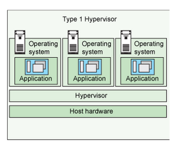
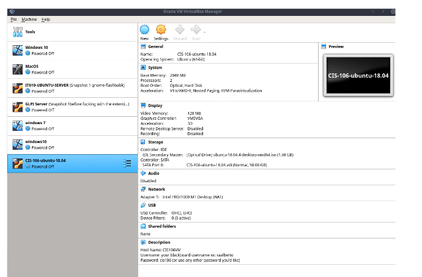

# Notes Lecture 2 | Installing Ubuntu

## What is Virtualization?
* Replication of hardware to simulate a virtual machine inside a physical one.
* Two general types of virtualization:
  * **server-side virtualization**
  * **client-side virtualization**
*  The basic difference between the two is **where the virtualization takes place.**

## Server-side virtualization - Virtual Desktop Infrastructure
* **Thick client**- needs hardware and software
* **Thin client**- only needs hardware
* **Zero client**- only requires monitor to run client.

## Client-side virtualization
* Software installed on a computer to manage virtual machines.
* Each VM has it's own OS installed
* For client-side virtualization, the computer needs:
    * A hypervisor(software that allows the management of virtual machines)
    * Capable CPU
    * Enough RAM
    * Enough storage
  
## Type 1 VS Type 2 Hypervisor

***Type 1***
* Runs on hardware
* Examples: VMware ESX and ESXI

***Type 2***
* Runs on host OS
* Examples: VMware workstation player and Oracle VirtualBox

## Benefits of Virtualization
* You can have multiple operating systems on one machine.
* Allows apps to be tested before installing them on a host server.
* Reduce cost by decreasing their physical hardware that must be purchased for a network.
* Offers the chance to experiment with untested programs without infecting host machines with viruses or other malware.

## VirtualBox 

* ***VirtualBox*** is a powerful type 2 virtualization product for enterprise as well as home use
* Open Source Software under the GPIv2
* Runs on: 
  * *Windows*
  * *Linux*
  * *Macintosh*
  * *Solaris*
* Supports many OS's

## VMWare Workstation Player

* Free of charge proprietary type 2 virtualization software
* ***Player*** is the free version of Workstation with less features
* Available for *Linux* and *Windows*
* Supports a large number of guest operating systems

## Can my computer virtualize?
* Specifications to virtualize:
  * *AMD V or INTEL V processor*
  * *Dual core *64 processor with 1.3 ghz or faster*
  * *4GB of RAM*
  * *Enough free Hard drive space*

## Installing Ubuntu in a virtual machine

* ***Create a virtual machine.***
* ***Create a name that indicates what os is being installed.***
* ***OS type**: Linux*
* ***Version: Ubuntu*** *(64-bit)*
* ***Designate RAM** - Ubuntu requires at least 2GB of RAM*
* ***Create a virtual hard disk** - this allows us to create a virtual hard disk with any size we specify*
* ***Hard disk file type** - click Virtualbox disc image*
* ***Storage on physical hard disk*** - select dynamically allocated, it will only use space on your physical drive as it fills up*
* ***File location and 50GB** - select folder to create the file in and select hard drive disk size 50GB*
* ***Enable clip redirection** - set clipboard to bidirectional so you can copy/paste text from host to guest and vice versa*
* ***Host name, Password, Username*** *- in the general description box, you may write notes like basic information about machine*
* ***Modify boot order***
* ***System and processor** - set the number of virtual CPU cores the guest OS's can see.*
* ***Display 128MB** - sets size of the memory provided by virtual graphics card available to the guest.*
* ***Storage**: a new VM includes the two storage devices - IDE Controller & SATA Controller*

## Starting your virtual machine

* Install **Ubuntu**: Starts Ubuntu installer. Ubuntu installer is called Ubiquity
* To start Ubiquity, double click on the “Install Ubuntu 18.04.4 LTS” icon. This will launch the installation wizard.
* Read the release notes that list all changes in the release. The default language is English.
* Ubiquity’s keyboard layout screen will automatically detect your keyboard. 
* Updates and other software
  * *Normal Installation* installs all the default applications.
  * *Minimal Installation* installs Only basic utilities and a web browser.
* Installation Type
  * *Erase disk* and install Ubuntu will erase and 
format the virtual hard drive to use Ubuntu 
  * *Something else* Allows you to partition your hard drive as you desire.
* Ubiquity warns you to review the changes made to the disk before continuing.
* Ubiquity’s Where are you screen? Screen allows you to select your location for setting the time zone.
* Ubiquity’s Who are you? Screen allows you to enter your computer’s information. 
* Ubiquity will display a slideshow with useful information about Ubuntu.
* After the installation is complete, you can continue testing the Ubuntu or you can reboot to 
start using Ubuntu.

