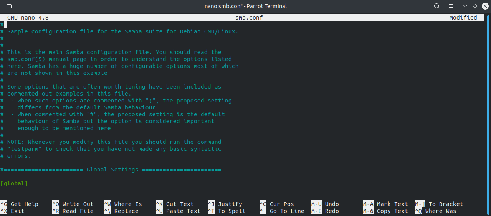

## Final Project | Build a file server - SAMBA server

### Requirements
* *2.4GHz or faster x86-compatible processor or Intel® Atom™ 1.6GHz or faster processor for netbooks*
* *4GB of RAM minimum (Recommended: 8GB or more)*

### Prequisites 
* Make sure you are logged into ubuntu with either the root user or user privileged.

* First open your terminal pn Ubuntu
  
#### Update Ubuntu
**On your command line please type the following command:**
   * **`sudo apt update`** 
     * *This command will let us know that our repository index is up to date.*

#### Installing Samba
**Next enter the following command:**
  * **`sudo apt install samba`**
    * *With the users permission this will allow us to install the application of SAMBA*

* **On the last line in the terminal a message asking** *"do you want to continue [ Y / n ]"* 
  * *Enter y or n*
* We need to make sure the installation was a success.
* Please clear your screen

#### Check Samba server status
**Let's make sure samba server is actually running.**
   * run the following command:
     * **`systemctl status smbd and nmbd`**
      * *On the output given you can see it says active (running) but also check to see if service is enabled.*

#### Configuring Firewall
**Now we need to make sure our Firewall is active.**
  * It is important that we enable the samba ports in your firewall. 
  * **Firewall** is preinstalled in Ubuntu, but after installation ufw is disabled.
* You can check the status using the command:
  * **`sudo ufw status`**

* Install nmap on your server and it will scan opened ports on the public IP address.
  * **`sudo apt install nmap`**

 
#### Scanning tcp & udp commands
**Next you will enter the following command:**
  * **`sudo nmap 12.34.56.78`**
    * *Replace 12.34.56.78 with the actual public IP address of your server.This will only scan tcp ports.*

* Nmap by default only scans TCP ports. We can use the following command to scan UDP ports.

  * **`sudo nmap -sU 12.34.56.78`**
  
 

#### Allowing inbound connections
* After obtaining the opened TCP and UDP ports on your server, you need to decide which ports should be allowed to accept inbound connections. 
  
**Please enter the following commands:**
* **`sudo ufw allow 25/tcp`**
* **`sudo ufw allow 587/tcp`**
* **`sudo ufw allow 143/tcp`**
* **`sudo ufw allow 993/tcp`**

#### Enabling UFW
* After you have set allowed ports in UFW, you need to enable UFW.
* First it's recommended to enable logging so that you can better understand if your firewall is working correctly.
* The default log level is ‘low’. 
* The log file is **/var/log/ufw.log**. 
  
**Please enter the following commmand:**

  * **`sudo ufw logging medium`**
  
**Now enable UFW.**

**`sudo ufw enable`** 

* *check status*
  * **`sudo ufw status`**

* **`sudo ufw allow samba`**

#### Editing the configuration file
* You will have to edit the configuration because the default is not going to be adequate.
* Under the terminal type **cd /etc/samba** to get into the samba directory. type **ls** and you will see the contents 
* main configuration file for samba     
  * *smb.conf*

#### Using Nano
* Use **Vim** or **Nano** to open up text file editor to edit the configuration
* In the command line enter: 
  * **`sudo nano /etc/samba/smb.conf`**
* **Sudo** is necessary to get the permission to save file.

  
* Under the global setting heading, on the fourth line is the workgroup listed by default. 
* **Name the workgroup anything you want.**   
  * *But if you change the name you need to make sure you do so on the other computer or servers that you want to be part of the workgroup.*

 
**You can find the setting on your Windows computer by going to Control Panel > System and Security > System.**

* In **global** section of the */etc/samba/smb.conf:* 
  *workgroup = WORKGROUP 
  * security = user,
  
* You can create a private or public share for public: 

[Share](Public) 
  * **(Share Name)**
    * folder where we going to open to other users on our network. 
* **Comment** = Shared folder
  * a short description of the share. 
* **Path** = /srv/samba/share
    * where is the path going to be found. what folder are we actually sharing to other users 
* **Browsable** = yes
    * allows window clients to browse the shared directory using Windows Explorer 
* **Guest ok** = yes
    * allows clients to connect to the share without a password
* **Read only** = no
    * determines if the share is read only or if writing privileges are granted. 
    * Write privileges are allowed only when the value is no, as is seen in this example.
    * If the value is yes, then access to the share is read only.
* **Create mask** = 0777
    *determines the permissions new files will have when created.

* Once done with editing the configuration file please use the the utility to check for errors using the command **testparm**.
  
#### Making a new directory under Samba
* Now since you do not want to share everything by default, we need to make a new shared folder where you can put everything you want to be accessible over the network.**
* From a terminal enter:
  * **`sudo mkdir -p /srv/samba/share`**
* This will create a new directory under samba called **share**

#### Changing file permissions
* Now to change the permissions please enter the command
  * **`sudo chown nobody:nogroup /srv/samba/share/`**

* Now you need to restart samba to to apply the changes you made to the configuration file:
  * **`sudo systemctl restart smbd nmbd`**

#### Accessing Samba Shared Folder From Windows
* **Network discovery** and **file sharing** are turned off.
* Click on the message and turn on network discovery and file sharing.

* To connect **Samba** share through the Linux command line, you will need a smbclient tool. 
* To install **smbclient**, open the Terminal run the following command:

**`sudo apt install smbclient`**

## *Works Cited*
* Adrian Mejia. “How to Set up Samba in Ubuntu/Linux, and Access It in Mac OS and Windows.” Adrian Mejia Blog, Adrian Mejia, 13 July 2011, adrianmejia.com how-to-set-up-samba-in-ubuntu-linux-and-access-it-in-mac-os-and-windows/. 

* Buzdar, Karim. “How to Install and Configure Samba on Ubuntu.” VITUX, 9 Sept. 2019, vitux.com/
how-to-install-and-configure-samba-on-ubuntu/. 

* “Install and Configure Samba Server on Ubuntu for File Sharing.” LinuxBabe, 1 Apr. 2021, www.linuxbabe.com/ubuntu/install-samba-server-file-share. 

* JtheLinuxguy. “Setting up Simple Samba File Shares.” YouTube, YouTube, 29 Aug. 2020, www.youtube.com/watch?v=7Q0mnAT1MRg. 
  
* “Samba - File Server.” Ubuntu, ubuntu.com/server/docs/samba-file-server. 

* Using Smbclient, www.learnlinux.org.za/courses/build/net-admin/ch08s02.html. 