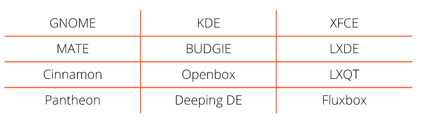
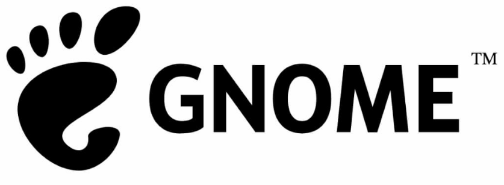
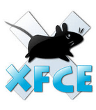
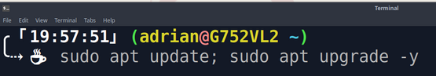
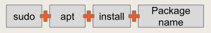
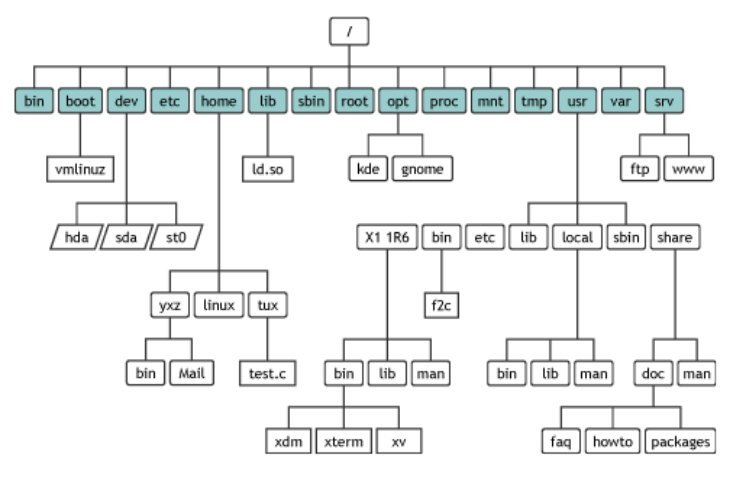
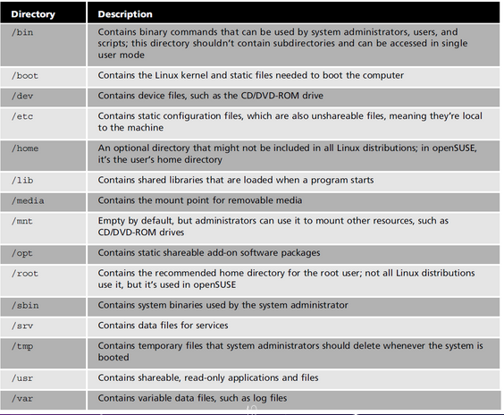
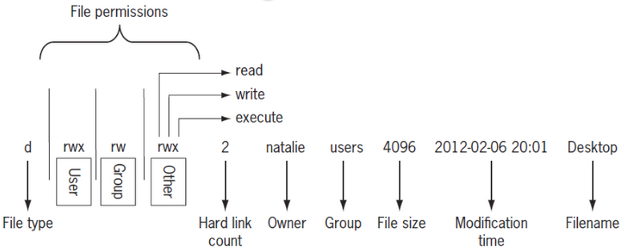

# Notes Lecture 3 | Learning the Bash Shell

## Desktop Environments
* Before DE there was CLI (command line interface)
* Examples:

* **GUI**: A graphical user interface is a set of programs that allows a user to interact with the computer system via icons, windows, and various other visual elements.
* **DE**: A desktop environment is an implementation of the desktop metaphor made of a bundle of programs running on top of a computer operating system, which shares a common GUI, sometimes described as a graphical shell. 
* On Windows and macOS the user is limited to a single GUI and DE but with Linux, you have many GUI choices.
* A desktop environment is typically broken up into the following graphical sections and functions:
  * *Desktop Setting*
  * *Display Manager*
  * *File Manager*
  * *Icons*
  * *Favorites Bar*
  * *Launcher*
  * *Menus*
  * *Panels*
  * *System Tray*
  * *Widgets*
  * *Window Manager*

## The GNOME Desktop Environment

* The default desktop in Ubuntu is *GNOME 3*. It is used not only by Ubuntu but also by several other Linux distributions, such as **Debian, Fedora, Red Hat Enterprise Linux**, and **Oracle Linux**. The official GUI for GNOME 3 is called **GNOME Shell**.
* GNOME is part of the GNU Project and developed by The GNOME Project which is composed of both volunteers and paid contributors, the largest corporate contributor being Red Hat.
* GNOME was started on August 15, 1997, by Miguel de Icaza and Federico Mena as a free software project to develop a desktop environment and applications for it.

## The KDE Desktop Environment
* The **Kool Desktop Environment (KDE)** got its start in 1996, with its first version released in 1998. 
* In 2009, KDE’s desktop environment was rebranded as KDE Plasma. 

## Other Desktop Environment
### XFCE Desktop Environment

* **XFCE** is a lightweight DE that aims to be fast and low on system resources, while still being visually appealing and user friendly.
* The XFCE project was started by Olivier Fourdan in 1996.
* Canonical offers an official flavor of Ubuntu with the Xfce DE called **Xubuntu**.
* Some distributions that use the XFCE DE include:
  * *Debian*
  * *Fedora*
  * *MX Linux*

### The Mate Desktop Environment

* The **MATE** Desktop Environment is the continuation of GNOME 2.
* MATE has forked applications from GNOME Core 
Applications and others have been written from scratch.
* MATE applications include:
  * **caja (box)** – file manager
  * **pluma (quill/feather/pen)** – text editor
  * **atril (lectern)** – document viewer 
  * **engrampa (staple)** – archive manager
  * **mate-terminal** – terminal emulator
  * **marco (frame)** – window manager 
* Canonical offers an official flavor of Ubuntu with the Mate DE called Ubuntu Mate.

### The Cinnamon Desktop Environment

* **Cinnamon** is a free and open-source desktop environment for the X Window System that derives from GNOME 3 but follows traditional desktop metaphor conventions.
* Cinnamon is the principal desktop environment of the Linux Mint distribution
* There is not an official flavor of Ubuntu with the 
Cinnamon DE, however it can be installed easily on 
all Linux distributions.

### The LXQT Desktop Environment
* **LXQT** is a light and runs on a single processor
*  LXQt is included in most Linux and BSD 
distributions.

### The Deepen Desktop Environment
* The **Deepin** Desktop Environment is the desktop 
environment of the Chinese Deepin Linux 
distribution.
* The Deepin DE is heavy and a MAC killer.
* Deepin is built on Qt and is available for various 
distributions including Ubuntu, Arch and Fedora.
* The Deepin developers maintain their own 
Window Manager called dde-kwin.

### The Pantheon Desktop Environment
* **Pantheon** is the desktop environment created for the Elementary OS. 
* Pantheon is written from scratch in Vala, 
using GTK 3 and Granite.
* Pantheon has some similarities with GNOME 
Shell and macOS

## What is a Shell?
* The **shell** is a interactive utility that provides a way for users to start programs, manage files, and processes running on the system.
* *The core of the shell is the command prompt.*
* The command prompt is the interactive part of the shell that allows you to enter commands, interprets them, and then executes them in the kernel.
* On the shell you can run two types of commands:
  * **internal commands**
  * **external commands**
* Shell commands that are grouped into files to execute a program is called *shell scripts*
* There are quite a few Linux shells available
* Different shells have different characteristics
* The default shell is the *bash shell*
* The bash shell is referred to as the "Bourne again shell"
###Examples of Linux Shells
Shell | Description
------|------------
**ash** | A simple, lightweight shell that runs in low-memory environments but has full compatibility with the bash shell
**korn** | A programming shell compatible with the Bourne shell but supporting advanced programming features like associative arrays and floating-point arithmetic
**tcsh** | A shell that incorporates elements from the C programming language into shell scripts
**zsh** | An advanced shell that incorporates features from bash, tcsh, and korn, providing advanced programming features, shared history files, and themed prompts
**fish** | A modern shell that provides advance features like autosuggestions, man page completion, 24 bit color support, web based configuration, and more

### Getting to the Shell
* Before graphical desktops, we had the text **command line interface (CLI)** provided by the shell.
* The Command line interface CLI allowed text input only and
could display only text and rudimentary
graphics output.

### Getting to the Shell | Console Terminals
* One way to get to a CLI is to take the Linux system out of graphical desktop mode and place it in text mode.
* This mode is called the **Linux console** because it emulates the old days of a hard-wired console terminal.
* When the Linux system starts, it automatically creates several virtual consoles, which is a terminal session thats runs in linux system memory.

### Getting to the Shell | GUI Terminal Emulators
* The alternative is a terminal emulation package from within the Linux graphical desktop environment.
* A terminal emulation package simulates working on a console terminal, but within a desktop graphical window.

## Managing files

### Basic Terminology
* **Package**: archives that contain binaries of software, configuration files, and information about dependencies.
* **Library**: reusable code that can be used by more than one functions
* **Dependency**: software needed as a foundation for other software.
* **Repository**: a large collection of software available for download. 

### The Debian Package Management System
* The **Debian Package Management System (DPMS)** is the foundation for managing software on all Debian distributions.
* DPMS installs packages
* .deb file- any file with the extension, .deb is a Debian file
* At the core of the DPMS is the dpkg (Debian Package) application.

### Installing Software via the CLI
* **APT- (advanced packaging tool)**- tools to manage debian packages
* APT handles dependencies in software and can do installation resuming
* APT can search for packages in local cache
* Apt is used for updating all the packages in the system

#### How to update any debian distro:

* **sudo** - allows you to run commands as a root user
* **apt** - program we use to update
* **update** - used to download pkg info
* **;** - to terminate a command, allowing multiple commands
* **upgrade** - to update all apps and software
* **y**- a flag that signifies yes to all prompts

### Installing software with APT

* Add a package with " **+** "
* Remove a package with " **-** "
* `sudo apt install firefox flameshot caffeine -y`
    * **Install multiple programs in one command**
* `sudo apt remove firefox flameshot caffeine -y`
    * **Removes multiple programs in one command**
* `sudo apt install firefox+ flameshot-caffeine- vlc+`
    * **Install and remove multiple programs in one command**
* `sudo apt purge firefox+ flameshot- caffeine- vlc+`
    * **remove all traces**

### How to search for software with Apt
* `apt search “web browser”`
  * **Search for all programs that matches the text in quotes**
* `apt-cache search firefox`
  * **Search for information about a given package including dependencies.**

### UBUNTU PPAs
* Ubuntu’s Official Repositories are:
  * **Main** - Canonical-supported free and open-source software.
  * **Universe** - Community-maintained free and open-source software.
  * **Restricted** - Proprietary drivers for devices.
  * **Multiverse** - Software restricted by copyright or legal issues.
* **PPA (Personal Package Archive)**: allows developers to upload Ubuntu Source Packages to be built and published as repositories.
* PPAs only work on Ubuntu and Ubuntu Derivatives.

### How to add & remove a PPA to Ubuntu

* `sudo add-apt-repository ppa:atareao/telegram`
  * **Add PPA**
* `sudo add-apt-repository --remove ppa:atareao/telegram`
  * **Remove PPA** 

### Installing Software using .deb files
* Ubuntu and all debian Distributions use .deb files to install software.
* Debian packages are standard Unix tar archives that include two tar archives. One archive holds the control information and another contains the 
installable data.
* To install a .deb package you need to download the .deb file first.
* You can install deb files in the command line with dpkg or gdebi.

### Install .deb file

* `Sudo dkpg -i google-chrome-stable_current_amd64.deb`
  * **Install a .deb file with dpkg**
* `sudo gdebi google-chrome-stable_current_amd64.deb`
  * **Install a .deb file with gdebi**

* **Gdebi** is a simple tool to install deb files. It lets you install local deb packages resolving and installing its dependencies.
* Gdebi needs to be installed before you can use it since it is not installed by default on Ubuntu. 

## Snaps and Flatpak
###Using Snapcraft
* **Snaps** are app packages for desktop, cloud and IoT that are easy to install, secure, cross-platform and dependency-free.
  * *snap* is both the command line interface and the application package format
  * *snapd* is the background service that manages and maintains your snaps
  * *snapcraft* is the command and the framework used to build your own snaps
  * *Snap Store* provides a place to upload your snaps, and for users to browse and install

### How to install/remove snap packages?

* `snap find “video player”`
    * **Searching for a snap**
* `sudo snap install vlc`
  * **Install a snap**
* `sudo snap remove vlc`
  * **Remove a snap**

### Using flatpak
* **Flatpak** is a next generation technology for packaging, distributing, and managing software in Linux.
* Flatpak, like Snaps, are distro agnostic which means that they work on every Linux distribution.
* Flatpak is not installed by default in ubuntu.

### How to install/remove flatpak packages?
* `flatpak search video`
  * **Searching for a flatpak**
* `flatpak install vlc`
  * **Install a flatpak**
* `flatpak uninstall vlc`
  * **remove a flatpak**

### Installing Software via the GUI
* *Ubuntu Software Center*
* *Using Gdebi graphically*
* *Synaptic package manager*
  * **Synaptic** is a graphical front-end to apt.
  * Synaptic can install, remove, configure, or upgrade software packages, browse, sort and search the list of available software packages, manage repositories, or upgrade the whole system. 

## The Linux Filesystem
* **File system**: The way files are stored and organized to simplify access to data.
* The first directory in the file system is called the *root directory*. The root directory contains files and subdirectories.
* **Filesystem Hierarchy Standard (FHS)** Specifies requirements and guidelines for file and directory placement in UNIX-like operating systems. 

#### The Linux Directory Structure
* You are always working inside a particular directory and you can move forward to a **subdirectory** or backwards to the previous directory - called a **parent directory**.
* The directory where you are at the moment is called the **current working directory** or **present working directory**.
* In a filesystem, every file has a pathname which indicates the location of the file in the filesystem (like an address).

#### Commands to move around the filesystem
* The **pwd** command
  * used for displaying the current working directory
  * type pwd
* The **cd** command
  * used for changing directory
* The **ls** command
  * used for displaying all the files inside a given directory. When no directory is specified, ls displays the files in the current working directory
* *Types of path names:*
  * **Absolute path**- States the full pathname starting from root (/). Always starts from the root. 
  Example: /home/john/Downloads/song.mp3
  * **Relative Path**- – Specifies the pathname starting from the current directory. Always starts with a subdirectory.
  Example: Downloads/song.mp3

#### The cd command
* **cd + destination** 
* Destination can be an absolute path or a relative path
* **../** - takes you back one directory
* **cd** - takes you home
* **cd -** : take you to the previous directory
* Change from your home directory change to your Downloads directory.
    * **cd Downloads**
* Change from anywhere in the file system change to your Downloads directory.
    * **cd ~/Downloads**

#### Bash Features
* **Tab completion** - press tab to autocomplete
* **Arrow key** - navigates directories in history
* **Ctrl + a** – go to the start of the command line
* **Ctrl + e** – go to the end of the command line

### Listing files and directories
* **ls** is used for listing the content of a given directory or the file/directory itself.
* ls can be used with or without arguments. 
* ls has alot of options. use man ls to view all the options
* **ls -a**
  * List all the files inside the current working directory including hidden files.
* **ls -a ~/Pictures**
  * List all the files inside a given directory
* **ls -lR ~/Pictures**
  * Long list all the files inside a given directory recursively

#### Examining ls -l command

* **File type** : “d” for directory
* **File permissions** : displayed three categories - user, group, and other
* **Hard links** : number of hard links associated with the file
* **Owner** : user owner of the file
* **Group** : file’s group owner
* **File size** : in bytes by default
* **Modification time** : timestamp showing when the file was last modified
* **Filename** : name of the file

