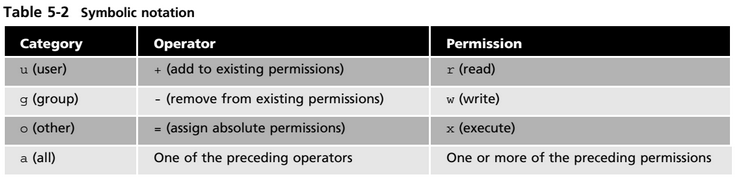

# Notes Lectures 6 | Managing Data and File Permissions
## Managing Data
### Basic Terminology
* **Backup**: Copies files and directories to an archive 
* **System Backup**: Use to restore data in case of a system failure or data loss and 
corruption
* **Archive**: File containing many other files, each of which is still identified by its filename, 
owner, permissions, and timestamp
* List of important directories to include in system backups:

### Archiving utilities
* **Tar (tape archive)**: creates archives by combining files and directories into a single 
file. 
* **CPIO**: Creates an archive, restores files from an archive, or copies a directory 
hierarchy. The cpio utility has three modes of operation:
  * *Create*: mode places multiple files into a single archive file, 
  * *Extract*:  mode restores files from an archive, 
  * *Pass-through*: mode copies a directory hierarchy. 
* **Ar** : creates, modifies, and extracts from archives

### The tar Program
* To create an archive: 
  * **tar + options + archive name + files to add to archive**
* To extract an archive: 
  * **tar + options + file to extract**

Tar Command Explained:

* The option **-f** is always required.
* Files inside an archive 
are called **members**.

### The cpio Program
* Cpio requires a list of files to archive. The option to create an archive is -o
  * **ls | cpio -ov > archive.cpio**
* To extract an a archive to cpio use the -i option with <
  * **cpio -iv < archive.cpio**

### The ar utility
* The GNU ar program creates, modifies, and extracts from archives.
Archive files with ar
* **ar r test.a *.txt***
List contents of an archive
* **ar t test.a**
Add a new member to an archive
* **ar r test.a test3.txt**
Delete a member from archive
* **ar d test.a test3.txt**

## File Compression
* The **gzip, bzip2**, and **xz** commands are used for compression. 
* File extension indicates the cmd used.
* Example:
  * file.txt ----> file.txt.**gz**
  * file.txt ----> file.txt.**bz2**
  * file.txt ----> file.txt.**xz**
* Gzip, bzip2, and xz compress files in place meaning the original file is deleted after compression. 
* **xz** produces better compression ratios than gzip and bzip2.

### File Compression | GZIP
* Compress a single file
  * *gzip File.txt*
* Decompress a file
  * *gzip -d file.txt*
* To decompress in a different directory use:
  * Compression utility -options < path of compressed file > file with the same name without extension
    * Example: **gzip -dkc < ~/compressedfile.iso.gzip > ~/Downloads/compressedfile.iso**

### File Compression | bzip2
* compress a file 
  * *bzip2 file.txt*
* decompress a file 
  * *bzip2 -d file.txt*

### File Compression | xz 
* compress a file 
  * *xz file.txt*
* decompress a file 
  * *xz -d file.txt.xz*

### File Compression | zip, 7zip, and rar
* **Zip** is an archiving and compression utility.
* To use zip: **zip + archiveName.zip + files to include in archive**
  * Example: zip allmyfiles.zip file1 file2 file3
* To unarchive use: **unzip archive.zip**

* **7-Zip** is an open source, cross-platform, and fully-featured file archiver with a high compression ratio.
* To use 7zip install the package: p7zip-full
* To create an archive: **7z + option + fileName.7z + file(s) to archive**

* **RAR** is a proprietary archive file format.
* The command **unrar** allows Linux users to extract rar archives. The command **rar** allows you to create rar archives.
* To use **unrar: **unrar + option + filename.rar**
* To use rar: **rar + option + archivename.rar + files to archive**

## Linux File Permissions
### Linux File Permissions | File Ownership
* **ls –l** shows you the file *user owner* and *group owner*.
* The */etc/passwd* file contains a list of all the users in Linux.
* The */etc/group* file contains a list of all the groups in Linux.
* The **chown** command is used for changing group owner.
    * Command :chown user:group file

###Linux File Permissions

###Files vs Directories

Files | Directories
------|------------
**R (read)** : Gives users permission to open a file and view its contents | **R (read)**: Allows users to list a directory’s contents with commands such as ls
**W (write)**: Gives users permission to open a file and edit its contents  | **W (write)**: Allows users to add or remove files and subdirectories | W (write): Gives users permission to open a file and edit its contents |
**X (execute)**: Allows users to run the file (as long as it’s a program or script) | **X (execute)**: Allows users to switch to the directory with the cd command.

* The **hypen (-)** represents a permission that hasn’t been granted
* **r** = permission is not set

### Linux File Permissions | The chmod command
* **chmod** cmd is used to change permissions on files and directories
* syntax-chmod persmissions file/directory
* you can use chmod in 2 ways to edit permissions:
    * **Symbolic Notation**
     
    * **Numeric Notation**
      

